# 消息历史版本管理系统设计技术报告（最终版 - 含多模型支持）

## 1. 系统概述

基于现有扁平化架构的最小化扩展，通过 **Topic快照 + Message字段扩展（含siblingIds）** 实现版本管理、分支对话和多模型并行回复功能。

### 1.1 核心设计理念

- **最小破坏性**：只扩展现有实体，不新增表
- **快照渲染**：通过Topic简单快照管理主线渲染顺序
- **关系扩展**：通过Message字段实现树状分支、双向链表版本、多模型兄弟关系

## 2. 数据结构设计

### 2.1 实体定义

```typescript
interface Topic {
  // === 现有字段保持不变 ===
  id: string
  name: string
  createdAt: string
  updatedAt: string

  // === 保持简单快照 ===
  activeMessageIds: string[] // 当前活跃对话主线的消息ID顺序
}

interface Message {
  // === 现有字段保持不变 ===
  id: string
  role: 'user' | 'assistant' | 'system'
  topicId: string
  blocks: MessageBlock['id'][]

  // === 新增：关系字段 ===
  askId?: string // 问答关系：assistant指向对应的user消息
  parentMessageId?: string // 分支关系：指向回复的目标消息
  version?: number // 版本号（assistant消息专用）
  prevVersionId?: string // 版本链表：前一版本
  nextVersionId?: string // 版本链表：后一版本
  groupRequestId?: string // 请求分组：同次API请求的标识
  siblingIds?: string[] // 兄弟关系：同级多模型回复的ID列表
}

interface MessageBlock {
  // === 完全不变 ===
  id: string
  messageId: string
  type: MessageBlockType
  content: string
  // ...其他现有字段
}
```

### 2.2 数据关系图

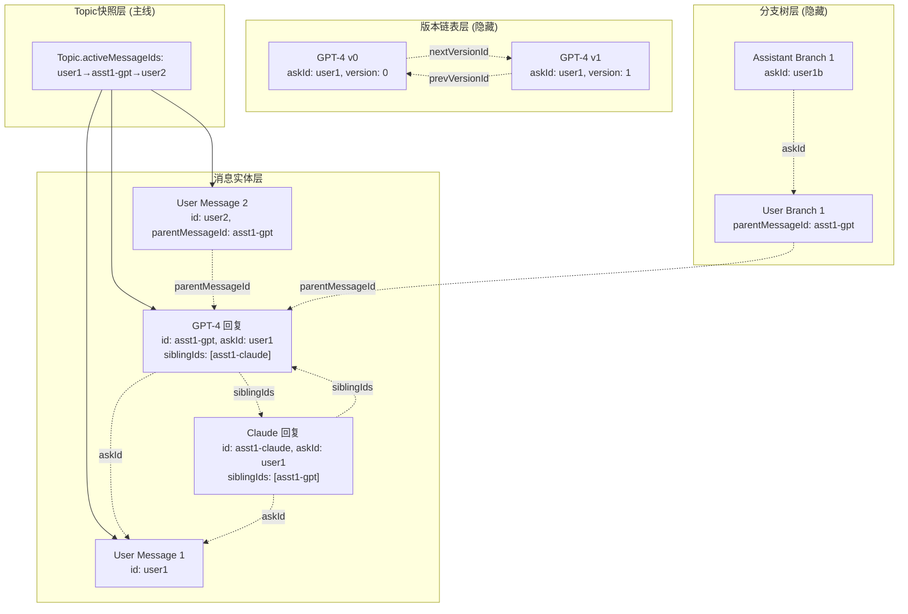

## 3. 核心操作流程

### 3.1 发送新消息（多模型）

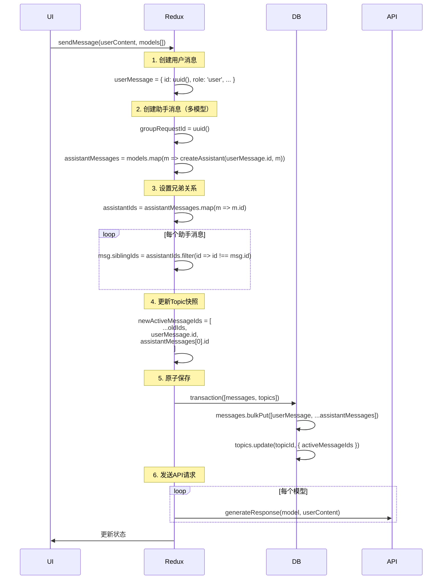

**复杂度**：O(M) where M = 模型数量

### 3.2 重发消息（版本管理）

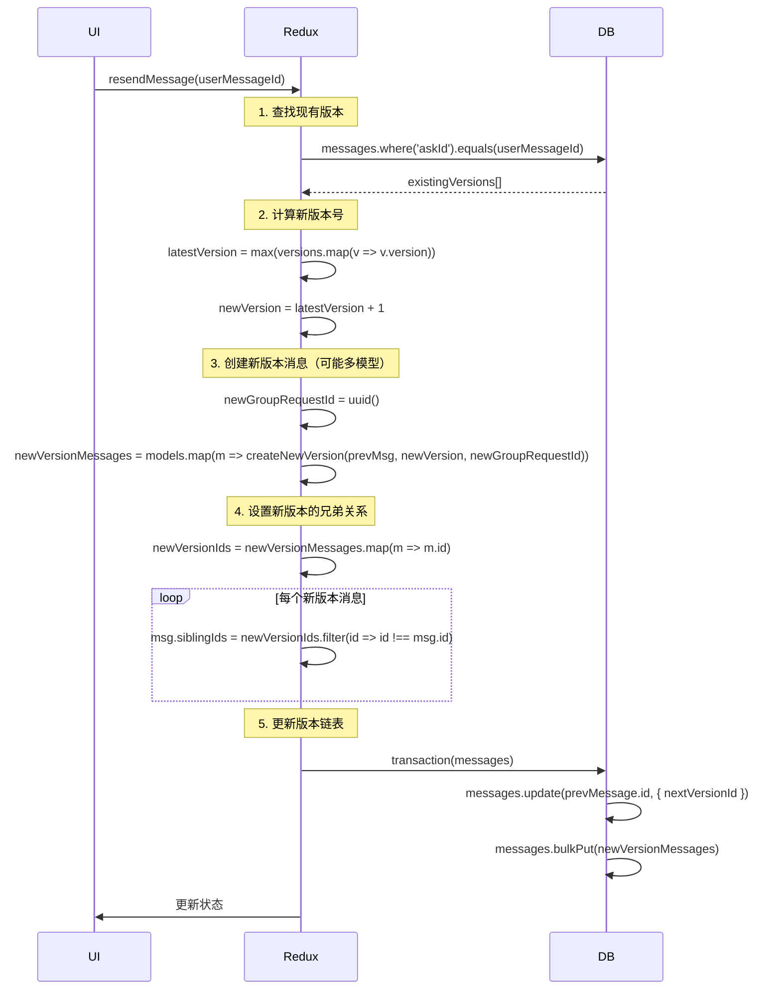

**复杂度**：O(V) 查找 + O(M) 创建

### 3.3 切换活跃模型（UI交互）

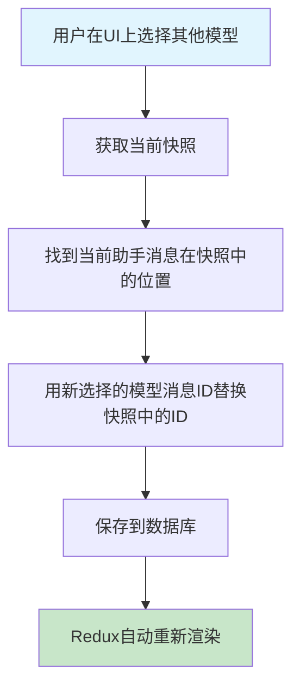

```typescript
const switchActiveModel = async (topicId: string, messageIndex: number, newModelMessageId: string) => {
  const topic = await db.topics.get(topicId)
  const newActiveMessageIds = [...topic.activeMessageIds]
  newActiveMessageIds[messageIndex] = newModelMessageId

  await db.topics.update(topicId, { activeMessageIds: newActiveMessageIds })
}
```

**复杂度**：O(1)

## 4. 字段作用详解

### 4.1 关键字段关系图

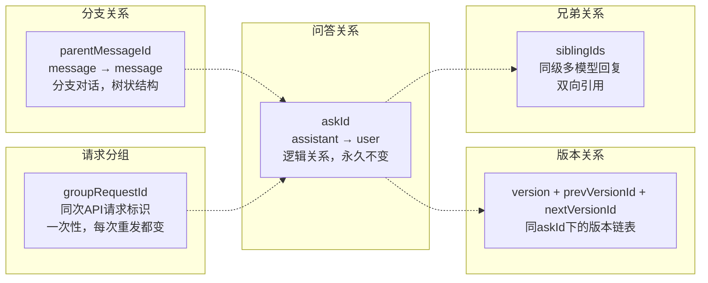

### 4.2 字段使用场景

| 字段                             | 用途       | 查询场景                   | 生命周期 |
| -------------------------------- | ---------- | -------------------------- | -------- |
| **askId**                        | 问答映射   | 查找用户问题的所有回复版本 | 永久不变 |
| **parentMessageId**              | 分支对话   | 查找某消息的回复分支       | 永久不变 |
| **version + prev/nextVersionId** | 版本管理   | 版本历史导航               | 永久不变 |
| **groupRequestId**               | 请求追踪   | 批量状态更新、请求监控     | 一次性   |
| **siblingIds**                   | 多模型并行 | 渲染同级多模型回复         | 永久不变 |

### 4.3 多模型并行渲染示例

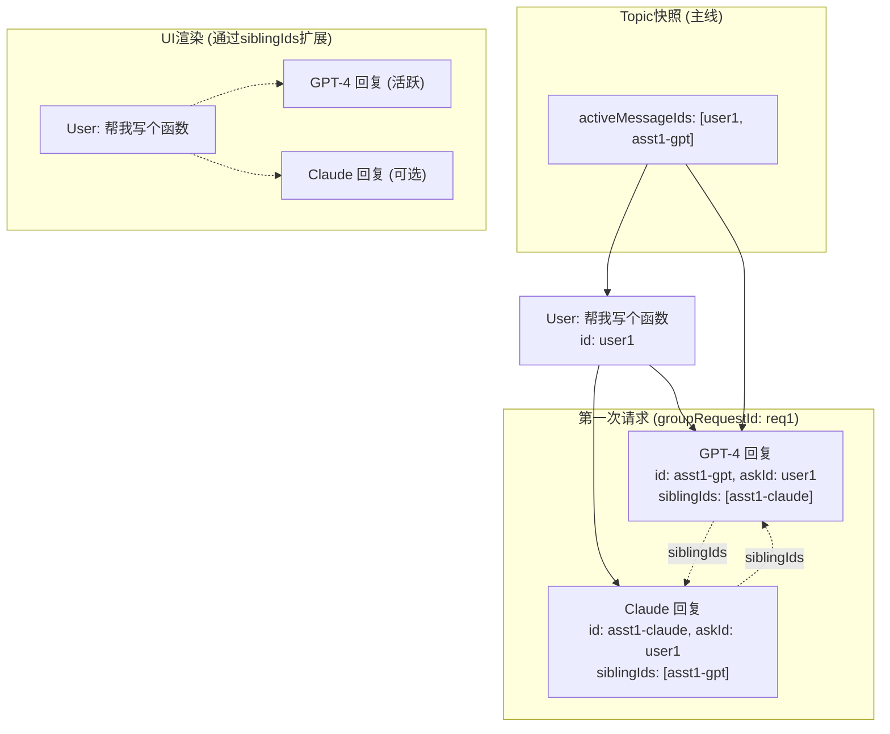

## 5. 数据查询与状态管理

### 5.1 话题加载流程

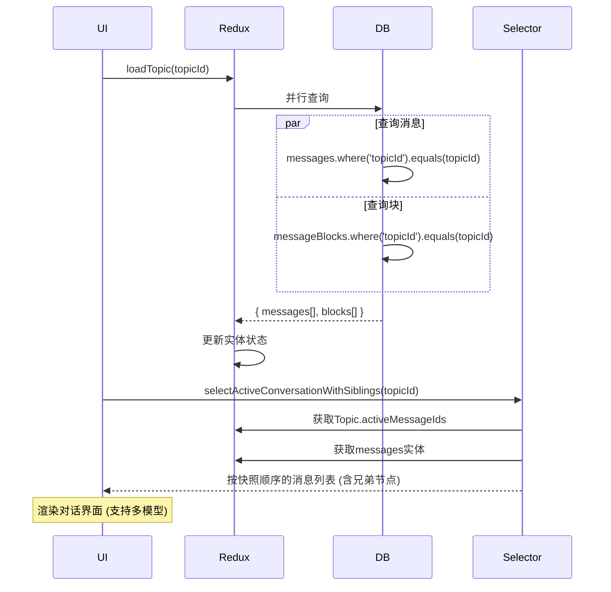

### 5.2 渲染选择器（含兄弟节点）

```typescript
export const selectActiveConversationWithSiblings = createSelector(
  [
    (state: RootState, topicId: string) => state.topics.entities[topicId]?.activeMessageIds || [],
    (state: RootState) => state.messages.entities,
    (state: RootState) => state.messageBlocks.entities
  ],
  (activeMessageIds, messagesEntities, blocksEntities) => {
    return activeMessageIds
      .map((messageId) => {
        const message = messagesEntities[messageId]
        if (!message) return null

        if (message.role === 'user') {
          return { type: 'user', message, blocks: getMessageBlocks(message, blocksEntities) }
        } else if (message.role === 'assistant') {
          const siblingMessages = (message.siblingIds || []).map((id) => messagesEntities[id]).filter(Boolean)
          const allAssistantMessages = [message, ...siblingMessages]

          return {
            type: 'assistant_group',
            messages: allAssistantMessages.map((msg) => ({
              message: msg,
              blocks: getMessageBlocks(msg, blocksEntities),
              isActive: msg.id === messageId
            })),
            activeMessageId: messageId
          }
        }
      })
      .filter(Boolean)
  }
)
```

**复杂度**：O(N + S) where N = 快照长度, S = 兄弟节点总数

## 6. 时空复杂度分析

### 6.1 核心操作复杂度对比

```mermaid
graph LR
    subgraph "现有架构"
        A1[加载话题: O(M+B)]
        A2[渲染对话: O(M) 需要过滤排序]
        A3[发送消息: O(1)]
    end

    subgraph "新架构 (含多模型)"
        B1[加载话题: O(M+B) ✅相同]
        B2[渲染对话: O(N+S) ✅更优]
        B3[发送消息: O(M_models) ✅相同]
        B4[版本切换: O(1) ➕新功能]
        B5[重发消息: O(V)+O(M_models) ➕新功能]
        B6[模型切换: O(1) ➕新功能]
    end

    style B1 fill:#c8e6c9
    style B2 fill:#c8e6c9
    style B3 fill:#c8e6c9
    style B4 fill:#fff3e0
    style B5 fill:#fff3e0
    style B6 fill:#fff3e0
```

### 6.2 性能优势分析

| 操作         | 现有架构       | 新架构                       | 优势说明             |
| ------------ | -------------- | ---------------------------- | -------------------- |
| **话题加载** | O(M + B)       | O(M + B)                     | 性能保持不变         |
| **对话渲染** | O(M) 过滤+排序 | **O(N+S)** 直接索引+兄弟扩展 | N << M，S通常较小    |
| **发送消息** | O(1)           | O(M_models)                  | 支持多模型，合理增长 |
| **版本切换** | 不支持         | **O(1)**                     | 新功能，极佳性能     |
| **模型切换** | 不支持         | **O(1)**                     | 新功能，极佳性能     |

**关键优势**：

- **渲染性能提升**：从 O(M) 优化到 O(N+S)，长对话场景收益显著
- **多模型支持**：通过 siblingIds 优雅实现
- **版本管理**：O(1) 的版本/模型切换，用户体验极佳
- **向后兼容**：现有核心操作性能保持不变

## 7. 数据库Schema演进

### 7.1 Migration策略

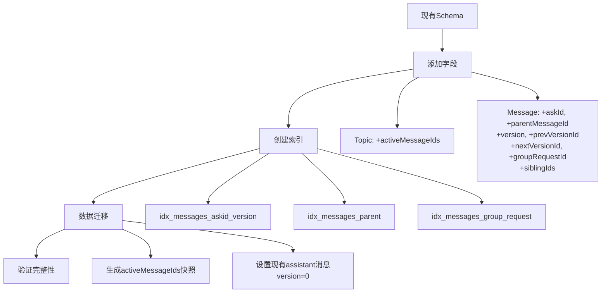

### 7.2 SQL Migration

```sql
-- 1. 添加字段
ALTER TABLE topics ADD COLUMN activeMessageIds TEXT; -- JSON数组
ALTER TABLE messages ADD COLUMN askId TEXT;
ALTER TABLE messages ADD COLUMN parentMessageId TEXT;
ALTER TABLE messages ADD COLUMN version INTEGER;
ALTER TABLE messages ADD COLUMN prevVersionId TEXT;
ALTER TABLE messages ADD COLUMN nextVersionId TEXT;
ALTER TABLE messages ADD COLUMN groupRequestId TEXT;
ALTER TABLE messages ADD COLUMN siblingIds TEXT; -- JSON数组

-- 2. 创建索引
CREATE INDEX idx_messages_askid_version ON messages(askId, version);
CREATE INDEX idx_messages_parent ON messages(parentMessageId);
CREATE INDEX idx_messages_group_request ON messages(groupRequestId);

-- 3. 数据迁移
UPDATE messages SET version = 0 WHERE role = 'assistant';
```

## 8. 流式更新兼容性

### 8.1 MessageBlock更新流程

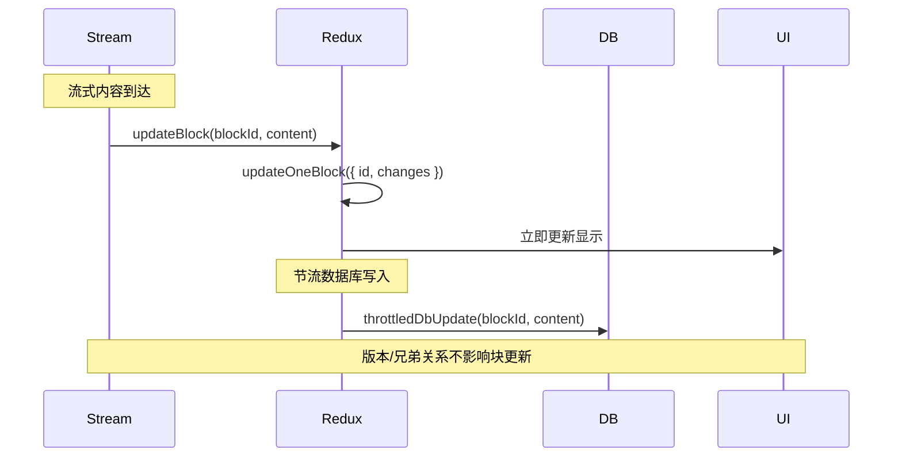

**关键点**：

- MessageBlock 仍然直接关联到 Message
- 版本/兄弟关系在 Message 层面，不影响 Block 的流式更新
- 现有的节流机制和更新逻辑完全保持不变

## 9. 系统架构总览

### 9.1 整体架构图

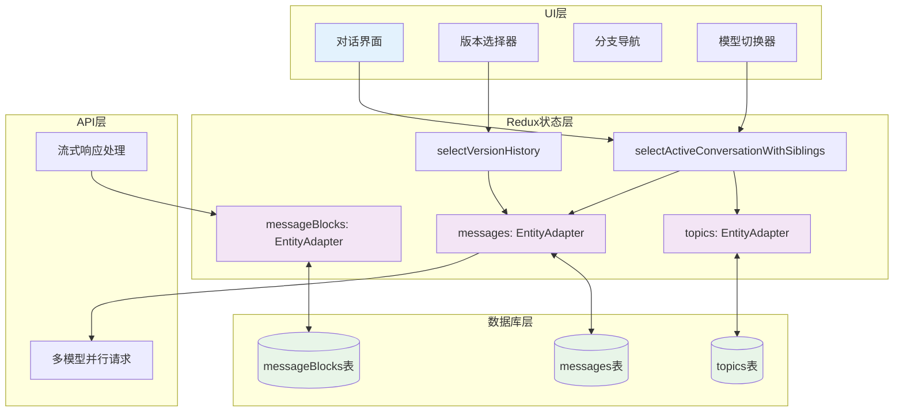

### 9.2 数据流向

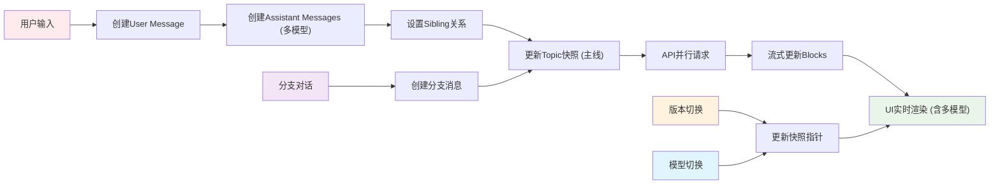
