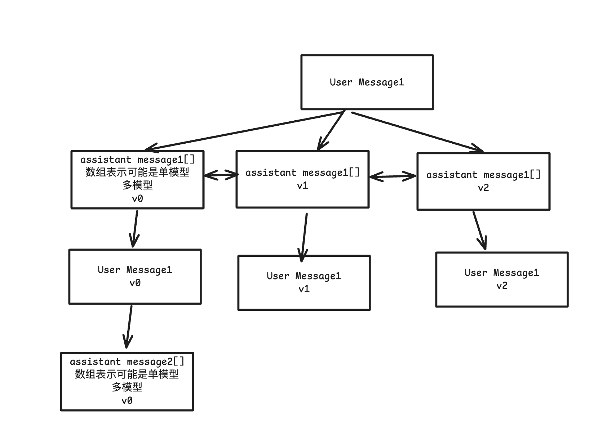

# 消息历史版本管理系统设计技术报告

## 1. 项目背景与需求

### 1.1 当前架构状态

- 已实现 `Message` 和 `MessageBlock` 的扁平化存储
- 使用 Redux `createEntityAdapter` 进行状态管理
- 数据库操作基于单个实体，已弃用 `topic.messages` 大数组
- 缺少版本管理和分支对话功能

### 1.2 设计目标



在现有扁平化架构基础上，增加：

- 有向多叉树的对话结构管理
- 双向链表的版本管理机制
- 分支对话支持
- 最小化对现有流式更新机制的影响

## 2. 架构演进设计

### 2.1 当前架构 vs 新架构

**当前架构**：

```
Topic → Message[] (通过 selector 组装)
Message → MessageBlock[]
```

**新架构**：

```
Topic → UserMessage ←→ UserMessage (线性链表)
         ↓
      AssistantMessageGroup ←→ AssistantMessageGroup (版本链表)
         ↓
      Message[] → MessageBlock[]
```

### 2.2 新增实体

| 新增实体                | 作用                   | 与现有实体关系                     |
| ----------------------- | ---------------------- | ---------------------------------- |
| `UserMessage`           | 用户消息节点，树的主干 | 包含现有 user role 的 Message 功能 |
| `AssistantMessageGroup` | 助手回复组，版本容器   | 组织现有 assistant role 的 Message |

**现有实体调整**：

- `Message`: 增加 `groupId` 字段，移除 user role
- `MessageBlock`: 保持不变
- `Topic`: 移除弃用字段，增加树指针，Topic 只维护当前"活跃对话路径"的快照，用户在 UI 上看到的默认对话流就是这个活跃快照

### 2.3 数据结构预览

```typescript
export interface UserMessage {
  // 基础标识
  id: string
  topicId: string
  createdAt: string
  updatedAt?: string
  status: UserMessageStatus
  // 消息内容关联
  blocks: MessageBlock['id'][]
  // 树结构关联 - 邻接列表
  parentAssistantGroupId?: string // 指向父助手消息组（回复哪个助手消息）
  // 线性链表关联 - 话题内用户消息顺序
  prevUserMessageId?: string // 前一个用户消息
  nextUserMessageId?: string // 后一个用户消息
}

export interface AssistantMessageGroup {
  // 基础标识
  id: string
  topicId: string
  createdAt: string
  updatedAt?: string
  status: AssistantMessageStatus

  // 树结构关联 - 邻接列表
  parentUserMessageId: string // 指向父用户消息（回复哪个用户消息）

  // 版本链表关联 - 同一用户消息下的不同版本
  version: number // 版本号，从 0 开始
  prevVersionGroupId?: string // 前一个版本组
  nextVersionGroupId?: string // 后一个版本组

  isActiveInTopic: boolean // 是否是当前活跃对话路径的快照

  // 内容容器关联
  messageIds: Message['id'][] // 包含的实际消息ID列表
}

export interface Message {
  // 基础标识
  id: string
  createdAt: string
  updatedAt?: string
  status: AssistantMessageStatus

  // 角色限制 - 不再包含 'user'
  role: 'assistant' | 'system'

  // 组织关联
  groupId: string // 指向所属的 AssistantMessageGroup

  // 消息内容关联
  blocks: MessageBlock['id'][]

  // 向后兼容字段（用于现有代码）
  askId?: string // 指向原始 UserMessage ID，保持向后兼容
  topicId?: string // 冗余字段，便于查询优化
}

export interface Topic {
  // 基础标识
  id: string
  createdAt: string
  updatedAt?: string

  // 树结构入口指针
  rootUserMessageId?: string // 第一个用户消息节点ID
  latestUserMessageId?: string // 最新用户消息节点ID
  activeConversationPath: {
    // 新增：活跃路径快照
    userMessageIds: string[] // 按时间顺序的用户消息ID列表
    activeGroupIds: string[] // 每个用户消息当前激活的助手组ID
  }

  /**
   * @deprecated 已弃用的扁平数组，保留向后兼容
   */
  messages: Message[]
}
```

## 3. 关键操作复杂度对比

### 3.1 变量定义

- `N`: 话题中用户消息轮次数量
- `V`: 每轮平均版本数量
- `M`: 每组平均消息数量
- `B`: 平均消息块数量

### 3.2 操作复杂度对比

| 操作           | 当前方案                    | 新方案              | 主要改进                                         |
| -------------- | --------------------------- | ------------------- | ------------------------------------------------ |
| **发送新消息** | O(1) 新增 + O(1) Topic更新  | O(1) 新增多个实体   | 实体数量增加，但复杂度相同                       |
| **重发消息**   | O(M×B) 删除旧块 + O(1) 重置 | **O(1) 创建新版本** | **支持版本保留，避免删除操作**                   |
| **加载话题**   | O(N×M+B) 批量查询           | O(N×M+B) 批量查询   | 只加载活跃路径的快照，不加载历史版本，复杂度相同 |
| **删除消息**   | O(K) 删除相关实体           | O(K) 删除相关实体   | 复杂度相同                                       |
| **版本切换**   | **不支持**                  | **O(1) 指针查找**   | **新功能**                                       |
| **分支对话**   | **不支持**                  | **O(1) 创建分支**   | **新功能**                                       |

### 3.3 性能影响分析

**积极影响**：

- **重发操作优化**：从删除重建变为版本创建，避免数据丢失
- **版本管理**：O(1) 的版本切换和历史访问
- **并发安全**：版本隔离减少操作冲突

**成本增加**：

- **存储空间**：增加 `O(V)` 倍的版本存储开销
- **Selector 复杂度**：树状数据重组逻辑更复杂

## 4. 流式更新兼容性分析

### 4.1 现有机制保持不变

```typescript
// 现有的流式更新机制完全兼容
throttledBlockUpdate(blockId, { content, status }) // 仍然是 O(1)
dispatch(updateOneBlock({ id: blockId, changes })) // 仍然是 O(1)
```

### 4.2 新架构对流式更新的影响

- **MessageBlock 层面**：零影响，仍通过 `messageId` 直接关联
- **Message 层面**：增加 `groupId` 字段，不影响块更新逻辑
- **状态同步**：保持现有的节流机制和事务策略

## 5. Redux 状态管理演进

### 5.1 当前 State 结构

```typescript
// 当前已有
state = {
  messages: { ids: [], entities: {} }, // 现有
  messageBlocks: { ids: [], entities: {} } // 现有
  // 其他现有 slice...
}
```

### 5.2 新增 State 结构

```typescript
// 新增 slice
state = {
  // 现有保持不变
  messages: { ids: [], entities: {} },
  messageBlocks: { ids: [], entities: {} },

  // 新增
  userMessages: { ids: [], entities: {} },
  assistantMessageGroups: { ids: [], entities: {} }
}
```

### 5.3 迁移策略

1. **向后兼容**：现有 `Message` 和 `MessageBlock` API 保持不变
2. **渐进式迁移**：新功能使用新实体，现有功能继续工作
3. **Selector 适配**：调整 `selectMessagesForTopic` 以支持新的树状结构

## 6. 数据库迁移策略

### 6.1 Schema 演进

```sql
-- 保持现有表结构
Messages: id(PK), 现有字段..., groupId(新增)
MessageBlocks: id(PK), 现有字段... (无变化)

-- 新增表
UserMessages: id(PK), topicId, parentAssistantGroupId, prevUserMessageId, nextUserMessageId
AssistantMessageGroups: id(PK), topicId, parentUserMessageId, version, prevVersionGroupId, nextVersionGroupId
```

### 6.2 数据迁移

```typescript
// 迁移现有数据到新结构
const migrateExistingMessages = async () => {
  // 1. 识别 user role 的 Message，转换为 UserMessage
  // 2. 按 askId 分组 assistant role 的 Message，创建 AssistantMessageGroup
  // 3. 更新 Message 实体的 groupId 字段
  // 4. 构建链表指针关系
}
```

## 7. 技术债务与风险评估

### 7.1 新增复杂度

- **开发复杂度**：新增 2 个实体类型和相应的 CRUD 操作
- **测试复杂度**：版本管理和分支逻辑的测试覆盖
- **维护复杂度**：更复杂的数据一致性保证

### 7.2 性能风险

- **内存占用**：历史版本累积可能导致内存压力
- **查询性能**：复杂 Selector 可能影响渲染性能
- **存储增长**：版本保留策略需要清理机制

### 7.3 缓解措施

```typescript
// 版本清理策略
const cleanupOldVersions = async (topicId: string, keepVersions: number = 5) => {
  // 保留最近 N 个版本，清理旧版本
}

// 惰性加载优化
const loadTopicWithPagination = async (topicId: string, limit: number = 50) => {
  // 分页加载历史消息，避免一次性加载全部
}
```
